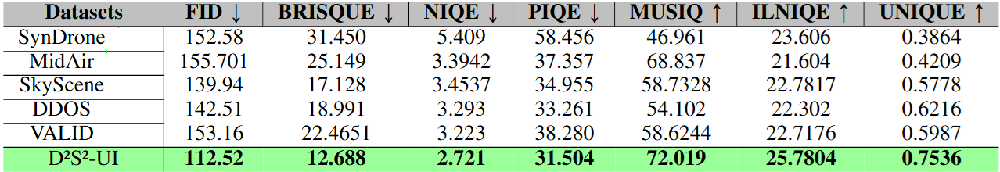
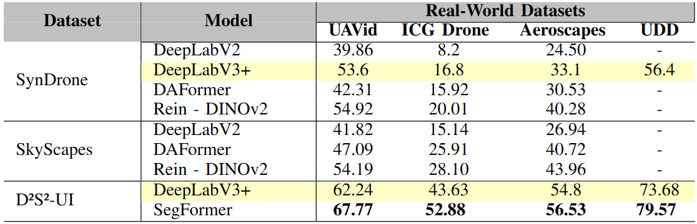
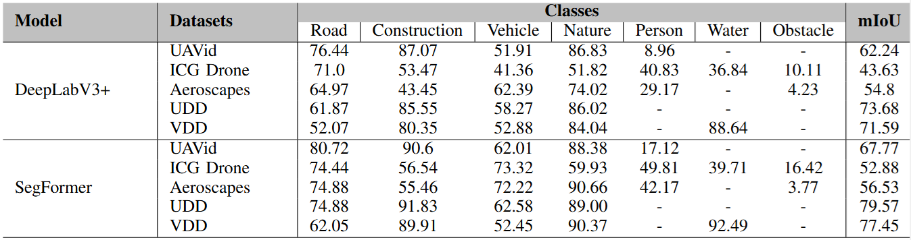

# Diffusion-Driven Synthetic Data for Unmanned Aerial Vehicle (UAV) Imagery
A Novel Dataset for Pixel-Level Semantic Segmentation for UAV Imagery.

## Authors:
- LATEEF Fahad
- KAS Mohamed
- RUICHEK Yassine

****

## D²S²-UI Dataset Description:

Diffusion-Driven Semantic Segmentation Dataset for UAV Imagery (D²S²-UI) offers a comprehensive and diverse collection of UAV imagery. It consists of ***7,000*** image-mask pairs, each with a 1024x1024 pixels resolution. These images encompass 8 distinct classes:
***Road*** (road, sidewalk), ***Nature*** (trees, grass, vegetation), ***Water*** (rivers, lakes, ponds), ***Vehicles***, ***Person*** (pedestrians), ***Construction*** (buildings, bridges, roofs, streetlights), ***Obstacle*** (fence, pole), and ***Void*** (background).

**Aerial views of multiple environments**, including residential courtyards, urban highways, parks, and residential complexes, showcasing a variety of infrastructure and landscape types.

D²S²-UI includes extensive ***multi-altitude*** (20m, 60m, 120m) and ***multi-viewpoint*** (Nadir 90°, high-oblique 60°, low-oblique 45°) coverage, providing diverse aerial perspectives essential for segmentation tasks. 

***Seasonal Variations***

***Various times of day*** (dawn, noon, dusk, night)

***Weather Conditions*** (rain, snow, fog, clear skies)

***Regionally inspired landscapes*** (Egyptian, Asian, European, American, and Arabic terrains).

**NOTE:** To the best of our knowledge, no other aerial semantic segmentation dataset offers a comparable level of variation and richness. Furthermore, a significant advantage of our approach lies in its scalability, as it allows for the generation of an unlimited number of labeled images and scenes, enabling further exploration and dataset expansion as needed.

****

## Dataset Availability: 

You will be automatically granted access to the subset of D²S²-UI on [Hugging Face](https://huggingface.co/datasets/fahad-lateef/D2S2UI).

The full dataset (approximately 20GB train+validation+test) will be uploaded soon.

****

## Tested Models availability:
The scale and diversity of D²S²-UI enhances the robustness and generalization of segmentation models. Experimental evaluations demonstrate that models trained on D²S²-UI surpass existing synthetic UAV datasets in segmentation accuracy and realism, while also showing strong generalizability to real-world UAV imagery.

## Results:

**Realism** analysis of the D²S²-UI dataset against existing synthetic aerial datasets.

Visual Comparison: D²S²-UI ***Vs*** Existing Synthetic Aerial Datasets.

Assessed the generalization capabilities of the D²S²-UI dataset using two prominent semantic segmentation models: [DeepLabV3+](https://github.com/VainF/DeepLabV3Plus-Pytorch) and [SegFormer](https://github.com/NVlabs/SegFormer). Comparison of D²S²-UI generalization performance (mIoU scores) with other synthetic datasets, SynDrone and SkyScenes.

Class-wise semantic segmentation results on real-world datasets. The segmentation models were trained on the D²S²-UI dataset and tested on unseen data.

Semantic Segmentation Results on Unseen Datasets: Performance of the [SegFormer](https://github.com/NVlabs/SegFormer) Model Trained on D²S²-UI Dataset.

****
## Citation:
When using or referring to the dataset please consider citing the following paper:

## Contributions
Please feel free to start an issue if you have questions about D²S²-UI.

## Acknowledgements
University Technology Belfort-Montbrliard, France [UTBM](https://www.utbm.fr/)
Connaissance et Intelligence Artificielle Distribuées [CIAD](http://www.ciad-lab.fr/)

## Inspiration
This work offers a scalable solution to the challenges of UAV-based semantic segmentation, reducing the need for manual annotations and enhancing dataset diversity and applicability. We hope that this will benefit the community and researchers working in the field.

## Terms of use

The D²S²-UI: Diffusion-Driven Synthetic Data for Unmanned Aerial Vehicle (UAV) Imagery dataset is provided freely for academic and non-commercial purposes, including research, teaching, and scientific publications. By accessing or using this dataset, you agree to the following terms:

**No Warranty or Liability:**
The dataset is provided "as is" without any express or implied warranties. While efforts have been made to ensure accuracy, [Our University] assumes no responsibility for errors, omissions, or any outcomes resulting from its use.

**Attribution Requirement:**
Any work, research paper, or publication that utilizes the D²S²-UI dataset must properly cite and reference it. For academic publications, please refer to our official paper.

**Restrictions on Redistribution:**
You may not redistribute, share, or republish this dataset or any modified versions in their raw form. However, you may share derivative works, such as trained models or additional annotations, provided they do not contain or enable reconstruction of the original dataset.

**Non-Commercial Use Only:**
The dataset and any derivative works must not be used for commercial purposes. This includes but is not limited to licensing, selling, or using the dataset for financial gain.

**Retained Rights:**
All rights not explicitly granted under these terms remain with [Our University]. Any unauthorized use beyond these terms requires prior written permission. By using the D²S²-UI dataset, you acknowledge and agree to these conditions. Failure to comply may result in restrictions on future access.
