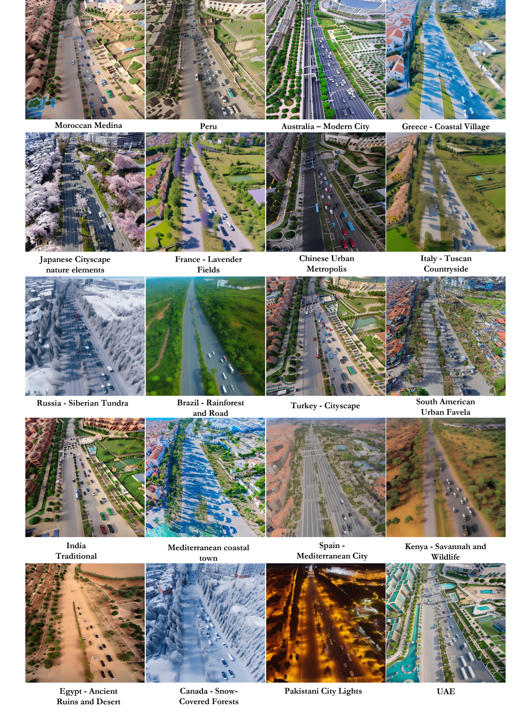
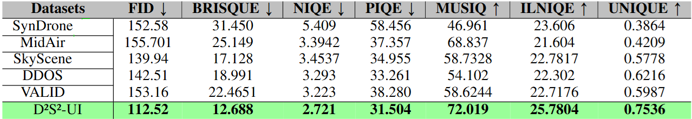
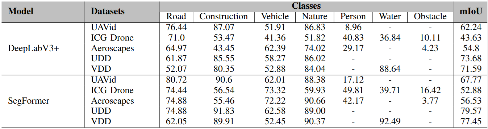
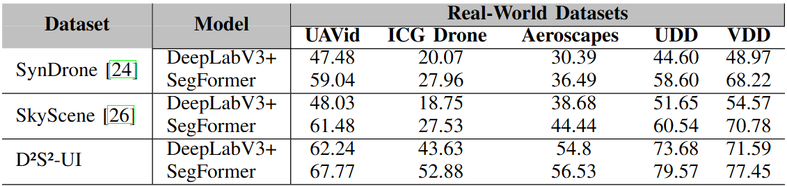

# Diffusion-Driven Synthetic Data Generation for UAV Imagery with Strong Real-World Generalization:
We introduce D²S²-UI, a novel synthetic UAV dataset for semantic segmentation, generated using an advanced text-to-image diffusion model. It offers a comprehensive and diverse collection of UAV imagery.
    
- It consists of ***7,000*** image-mask pairs, each with a 1024x1024 pixels resolution. These images encompass 8 distinct classes:
***Road*** (road, sidewalk), ***Nature*** (trees, grass, vegetation), ***Water*** (rivers, lakes, ponds), ***Vehicles***, ***Person*** (pedestrians), ***Construction*** (buildings, bridges, roofs, streetlights), ***Obstacle*** (fence, pole), and ***Void*** (background).

- Aerial views of multiple environments, including residential courtyards, urban highways, parks, and residential complexes, showcasing a variety of infrastructure and landscape types.

- Multi-altitude (20m, 60m, 120m) and multi-viewpoint (Nadir 90°, High-Oblique 60°, Low-Oblique 45°) coverage.

- Rich diversity in ***seasons***, ***weather***, ***time of day***, and ***geographical styles*** (Asian, Arabic, American, Egyptian, European).

Seasonal Variations

Various times of day (dawn, noon, dusk, night)

Weather Conditions (rain, snow, fog, clear skies)

Regionally inspired landscapes (Egyptian, Asian, European, American, and Arabic terrains).

This large-scale, highly diverse dataset improves the robustness and generalization of segmentation models. Experiments show that models trained on D²S²-UI outperform those trained on existing synthetic UAV datasets and generalize better to real-world UAV imagery.

****

**NOTE:** To the best of our knowledge, no other aerial semantic segmentation dataset offers a comparable level of variation and richness. Furthermore, a significant advantage of our approach lies in its scalability, as it allows for the generation of an unlimited number of labeled images and scenes, enabling further exploration and dataset expansion as needed.

****

## Dataset Availability: 

You will be automatically granted access to the subset of D²S²-UI on [Hugging Face](https://huggingface.co/datasets/fahad-lateef/D2S2UI).

The full dataset (approximately 25GB train+validation+test) will be uploaded soon.

****

## Experimental Results:

**Realism** analysis of the D²S²-UI dataset against existing synthetic aerial datasets using a range of image quality metrics.

Visual Comparison: D²S²-UI ***Vs*** Existing Synthetic Aerial Datasets.

We have assessed the generalization capabilities of the D²S²-UI dataset using two prominent semantic segmentation models: [DeepLabV3+](https://github.com/VainF/DeepLabV3Plus-Pytorch) and [SegFormer](https://github.com/NVlabs/SegFormer). Experimental evaluations demonstrate that models trained on D²S²-UI surpass existing synthetic UAV datasets in segmentation accuracy and shows strong generalizability to real-world UAV imagery. Class-wise semantic segmentation results on real-world datasets.

Semantic Segmentation Results on Unseen Datasets: Performance of the [SegFormer](https://github.com/NVlabs/SegFormer) Model Trained on D²S²-UI Dataset.

Comparison of D²S²-UI generalization performance (mIoU scores) with other synthetic datasets, SynDrone and SkyScenes, when evaluated using DeepLabV3+ and SegFormer deep learning models.

Visual comparison of SegFormer model performance (mIoU scores) on real-world UAV datasets (UAVid, ICG, UDD, VDD, and Aeroscapes) after being trained with SynDrone, SkyScene, and D²S²-UI.

 

****
## Cite this work:
When using or referring to the dataset please consider citing our [Paper](https://github.com/fahad-lateef/UAV-semantic-segmentation-dataset):    

Download Supplementary [file](https://github.com/fahad-lateef/UAV-semantic-segmentation-dataset) for high-quality visual results, class-wise scores from various experiments, details on the training algorithms and parameter settings, and the class merging map.

Please feel free to start an issue if you have questions about D²S²-UI.

## Acknowledgements

This study was supported by ANR/Institut Carnot ARTS under the TECTONIC project. The authors thank [CIAD](http://www.ciad-lab.fr/)-[UTBM](https://www.utbm.fr/) for their logistical and administrative assistance.

## Inspiration
This work offers a scalable solution to the challenges of UAV-based semantic segmentation, reducing the need for manual annotations and enhancing dataset diversity and applicability. We hope that this will benefit the community and researchers working in the field.

## Terms of use

The D²S²-UI: Diffusion-Driven Synthetic Data for Unmanned Aerial Vehicle (UAV) Imagery dataset is provided freely for academic and non-commercial purposes, including research, teaching, and scientific publications. By accessing or using this dataset, you agree to the following terms:

**No Warranty or Liability:**
The dataset is provided "as is" without any express or implied warranties. While efforts have been made to ensure accuracy, [Our University] assumes no responsibility for errors, omissions, or any outcomes resulting from its use.

**Attribution Requirement:**
Any work, research paper, or publication that utilizes the D²S²-UI dataset must properly cite and reference it. For academic publications, please refer to our official paper.

**Restrictions on Redistribution:**
You may not redistribute, share, or republish this dataset or any modified versions in their raw form. However, you may share derivative works, such as trained models or additional annotations, provided they do not contain or enable reconstruction of the original dataset.

**Non-Commercial Use Only:**
The dataset and any derivative works must not be used for commercial purposes. This includes but is not limited to licensing, selling, or using the dataset for financial gain.

**Retained Rights:**
All rights not explicitly granted under these terms remain with [Our University]. Any unauthorized use beyond these terms requires prior written permission. By using the D²S²-UI dataset, you acknowledge and agree to these conditions. Failure to comply may result in restrictions on future access.
